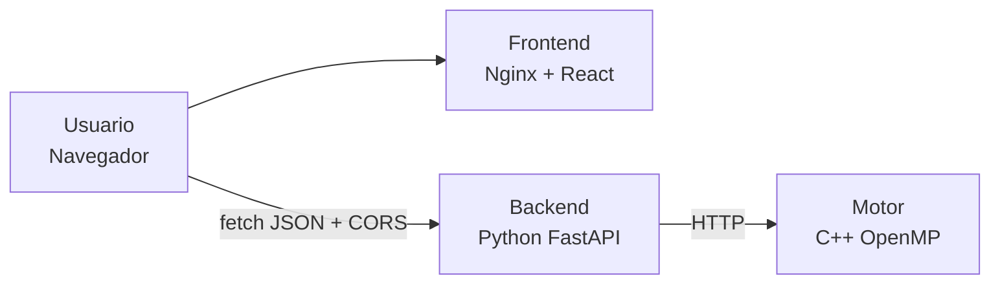

# 01 - Arquitectura del Sistema

## Visión General
El proyecto sigue una arquitectura de microservicios estricta dividida en tres contenedores completamente aislados. 

## Diagrama de Orquestación



## API REST y Contrato
La comunicación entre el Frontend y el Backend se realiza vía HTTP enviando y recibiendo cargas serializadas en formato JSON.

### Endpoint `/move`
- **Método:** POST
- **Entrada (Schema Pydantic):**
  ```json
  {
    "board": [4,4,4,4,4,4,0,4,4,4,4,4,4,0],
    "side": "south",
    "depth": 8,
    "threads": 4
  }
  ```
- **Salida Mínima Esperada:**
  ```json
  {
    "move": 3,
    "evaluation": 7,
    "elapsed_ms": 124,
    "stats": {
      "nodes": 1845210,
      "prunes": 312088
    },
    "threads_used": 4
  }
  ```

## Configuración de CORS
Para que el cliente web pueda comunicarse con el backend sin ser bloqueado por la *Same-Origin Policy* del navegador, se implementó el `CORSMiddleware` explícito en FastAPI permitiendo orígenes seguros.

*(Describa aquí por qué se escogieron los orígenes específicos configurados en FastAPI, y cómo se manejan las preflight requests OPTIONS)*:

