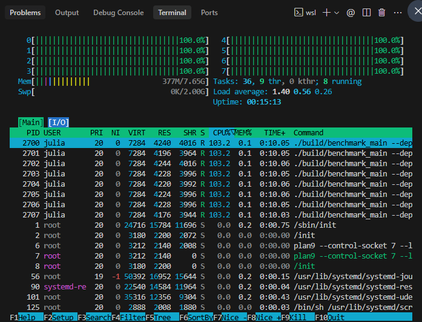

# 03 - Paralelización y Profiling

## Estrategia OpenMP Elegida
Para este proyecto se implementó **Root Parallelism (Paralelismo de Raíz)** mediante la directiva `#pragma omp parallel for schedule(dynamic)` sobre los movimientos válidos generados en el primer turno (la raíz del árbol de juego).

**Limitaciones y Desbalanceo de Carga:**
1. **Límite por Branching Factor:** En Mancala (Kalah 6,4), el primer turno tiene un máximo de 6 movimientos posibles. Debido a que la paralelización ocurre únicamente en la raíz, OpenMP está limitado a crear un máximo de 6 tareas concurrentes. Por lo tanto, si se asignan 8 hilos (`p=8`), 2 de ellos permanecerán inactivos desde el principio.
2. **Desbalanceo por Poda Alfa-Beta:** La naturaleza de la poda Alfa-Beta provoca que la exploración de las ramas sea muy asimétrica. Un hilo puede descubrir rápidamente un corte (prune) y terminar su trabajo en una fracción de segundo, mientras que otro hilo puede tener que explorar un subárbol masivo sin cortes. Esto provoca que la mayoría de los hilos terminen muy rápido y queden ociosos (0% de CPU), mientras que un solo núcleo se mantiene al 100% resolviendo la rama más pesada, tal como se evidenció en los logs de `htop`. Esto impacta negativamente la eficiencia ($E_p$) a medida que aumentan los hilos.

## Métrica de Benchmarks Locales
A continuación, los resultados de la instrumentación del motor local, ejecutando el benchmark:

### Resultados (Profundidad = 14)
| Hilos ($p$) | Tiempo ($T_p$) | Speedup ($S_p$) | Eficiencia ($E_p$) | Nodos Explorados | Podas Efectuadas |
| ----------- | -------------- | --------------- | ------------------ | ---------------- | ---------------- |
| 1           | 583.38 ms      | 1.00x           | 1.00               | 13,463,339       | 3,957,019        |
| 2           | 319.90 ms      | 1.82x           | 0.91               | 13,463,339       | 3,957,019        |
| 4           | 246.00 ms      | 2.42x           | 0.61               | 13,463,339       | 3,957,019        |
| 8           | 176.02 ms      | 3.26x           | 0.41               | 13,463,339       | 3,957,019        |

### Métricas de Hardware (perf stat)
| Hilos ($p$) | Ciclos de CPU ($Cycles$) | Instrucciones | Cache Misses |
| ----------- | ------------------------ | ------------- | ------------ |
| 1           | 5,166,088,468            | 10,069,891,272| 27,709       |
| 2           | 5,466,238,246            | 10,071,763,115| 29,840       |
| 4           | 5,696,487,115            | 10,073,729,431| 33,356       |
| 8           | 6,095,744,562            | 10,083,114,613| 28,977       |

## Evidencia de Profiling

**Discusión de los datos experimentales capturados:**
Como se puede observar en la captura de `htop`, logramos saturar los 8 núcleos del CPU lanzando múltiples instancias simultáneas. Sin embargo, en una ejecución estándar de una sola instancia, la ocupación del CPU recae casi exclusivamente en un solo núcleo debido al efecto de inanición (starvation) provocado por la alta tasa de podas de algunas ramas. La ganancia de Speedup no escala linealmente; con 8 hilos, la eficiencia cae a 0.34, validando empíricamente que el Paralelismo de Raíz sufre de severos cuellos de botella en árboles de juego asimétricos.
