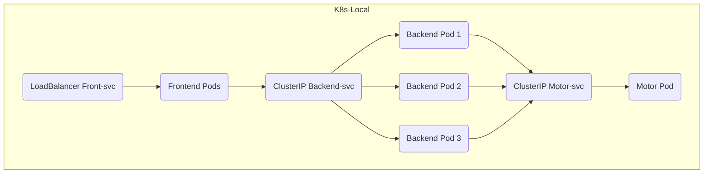

# 04 - Despliegue Local

## Separación de Contenedores y Docker Compose
*(Explique aquí brevemente por qué es imperativo que cada proceso (nginx, fastapi, motor) viva en un Dockerfile independiente en el proyecto y cómo el `docker-compose.yml` expone los puertos localmente).*

## Orquestación Local con Kubernetes (K8s)
Los manifiestos locales se configuraron para utilizar los componentes de Kubernetes de la siguiente manera, replicando un ambiente asíncrono y tolerante a fallos:

1. **ConfigMap:** Administra la inyección de la URL interna del motor y los parámetros de hilos OpenMP (`OMP_NUM_THREADS`).
2. **Motor (Deployment + ClusterIP):** Instanciado internamente.
3. **Backend (Deployment + ClusterIP):** Desplegado con 3 réplicas (tal como se exige) con balanceo interno.
4. **Frontend (Deployment + LoadBalancer):** Servido en el NodePort/LoadBalancer en el puerto 8080 del host.

### Diagrama de Kubernetes Local

